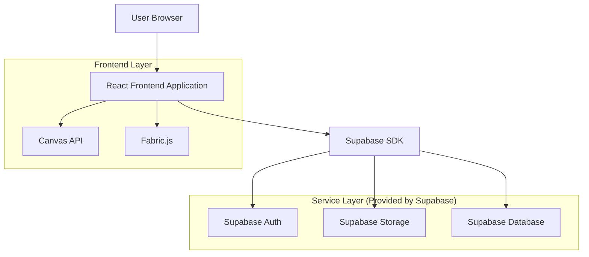
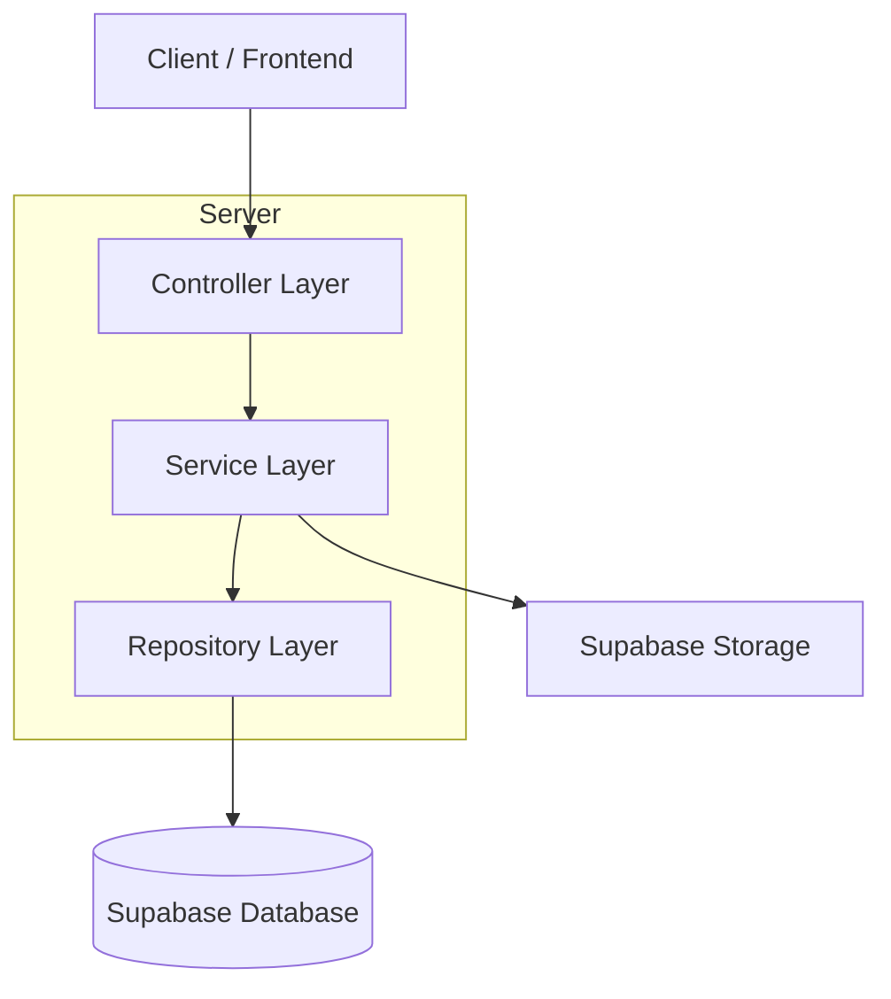
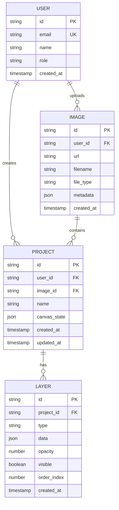

## 1. Architecture design



## 2. Technology Description
- Frontend: React@18 + tailwindcss@3 + vite
- Initialization Tool: vite-init
- Backend: Supabase (BaaS)
- Canvas Library: Fabric.js@5
- State Management: Zustand@4
- UI Components: headlessui@1 + heroicons@2

## 3. Route definitions
| Route | Purpose |
|-------|---------|
| / | 이미지 관리 페이지, 이미지 라이브러리 및 업로드 |
| /editor/:imageId | 편집 작업 페이지, 캔버스와 편집 도구 |
| /projects | 프로젝트 관리 페이지, 저장된 프로젝트 목록 |
| /login | 로그인 페이지, 사용자 인증 |
| /profile | 프로필 페이지, 사용자 설정 및 정보 |

## 4. API definitions
### 4.1 이미지 관리 API

이미지 업로드
```
POST /api/images/upload
```

Request:
| Param Name| Param Type  | isRequired  | Description |
|-----------|-------------|-------------|-------------|
| file      | File        | true        | 이미지 파일 (벡터/래스터) |
| metadata  | object      | false       | 유물 정보, 태그 등 |

Response:
| Param Name| Param Type  | Description |
|-----------|-------------|-------------|
| imageId   | string      | 이미지 고유 ID |
| url       | string      | 저장된 이미지 URL |
| metadata  | object      | 저장된 메타데이터 |

### 4.2 편집 데이터 API

프로젝트 저장
```
POST /api/projects/:projectId/save
```

Request:
| Param Name| Param Type  | isRequired  | Description |
|-----------|-------------|-------------|-------------|
| layers    | array       | true        | 레이어 데이터 |
| canvas    | object      | true        | 캔버스 상태 |
| version   | number      | true        | 버전 정보 |

Response:
| Param Name| Param Type  | Description |
|-----------|-------------|-------------|
| success   | boolean     | 저장 성공 여부 |
| version   | number      | 새로운 버전 번호 |

## 5. Server architecture diagram


## 6. Data model

### 6.1 Data model definition


### 6.2 Data Definition Language

사용자 테이블 (users)
```sql
-- create table
CREATE TABLE users (
    id UUID PRIMARY KEY DEFAULT gen_random_uuid(),
    email VARCHAR(255) UNIQUE NOT NULL,
    password_hash VARCHAR(255) NOT NULL,
    name VARCHAR(100) NOT NULL,
    role VARCHAR(20) DEFAULT 'user' CHECK (role IN ('user', 'expert', 'admin')),
    created_at TIMESTAMP WITH TIME ZONE DEFAULT NOW()
);

-- grant permissions
GRANT SELECT ON users TO anon;
GRANT ALL PRIVILEGES ON users TO authenticated;
```

이미지 테이블 (images)
```sql
-- create table
CREATE TABLE images (
    id UUID PRIMARY KEY DEFAULT gen_random_uuid(),
    user_id UUID NOT NULL REFERENCES users(id) ON DELETE CASCADE,
    url TEXT NOT NULL,
    filename VARCHAR(255) NOT NULL,
    file_type VARCHAR(50) NOT NULL,
    metadata JSONB DEFAULT '{}',
    created_at TIMESTAMP WITH TIME ZONE DEFAULT NOW()
);

-- create indexes
CREATE INDEX idx_images_user_id ON images(user_id);
CREATE INDEX idx_images_created_at ON images(created_at DESC);

-- grant permissions
GRANT SELECT ON images TO anon;
GRANT ALL PRIVILEGES ON images TO authenticated;
```

프로젝트 테이블 (projects)
```sql
-- create table
CREATE TABLE projects (
    id UUID PRIMARY KEY DEFAULT gen_random_uuid(),
    user_id UUID NOT NULL REFERENCES users(id) ON DELETE CASCADE,
    image_id UUID NOT NULL REFERENCES images(id) ON DELETE CASCADE,
    name VARCHAR(255) NOT NULL,
    canvas_state JSONB DEFAULT '{}',
    created_at TIMESTAMP WITH TIME ZONE DEFAULT NOW(),
    updated_at TIMESTAMP WITH TIME ZONE DEFAULT NOW()
);

-- create indexes
CREATE INDEX idx_projects_user_id ON projects(user_id);
CREATE INDEX idx_projects_image_id ON projects(image_id);

-- grant permissions
GRANT SELECT ON projects TO anon;
GRANT ALL PRIVILEGES ON projects TO authenticated;
```

레이어 테이블 (layers)
```sql
-- create table
CREATE TABLE layers (
    id UUID PRIMARY KEY DEFAULT gen_random_uuid(),
    project_id UUID NOT NULL REFERENCES projects(id) ON DELETE CASCADE,
    type VARCHAR(50) NOT NULL,
    data JSONB NOT NULL,
    opacity DECIMAL(3,2) DEFAULT 1.0,
    visible BOOLEAN DEFAULT true,
    order_index INTEGER NOT NULL,
    created_at TIMESTAMP WITH TIME ZONE DEFAULT NOW()
);

-- create indexes
CREATE INDEX idx_layers_project_id ON layers(project_id);
CREATE INDEX idx_layers_order_index ON layers(order_index);

-- grant permissions
GRANT SELECT ON layers TO anon;
GRANT ALL PRIVILEGES ON layers TO authenticated;
```