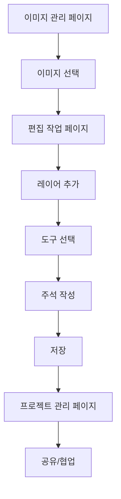

## 1. Product Overview
유물 이미지를 전문적으로 편집하고 관리하는 웹 애플리케이션입니다. 
연구자, 학생, 박물관 관계자들이 유물 이미지에 비파괴적인 주석과 편집을 통해 학술적 연구와 교육에 활용할 수 있도록 지원합니다.

## 2. Core Features

### 2.1 User Roles
| Role | Registration Method | Core Permissions |
|------|---------------------|------------------|
| 일반 사용자 | 이메일 회원가입 | 이미지 업로드, 기본 편집 기능 사용 |
| 전문가 사용자 | 이메일 회원가입 + 전문가 인증 | 고급 편집 도구 사용, 협업 기능 |
| 관리자 | 초대 코드 | 전체 이미지 관리, 사용자 관리 |

### 2.2 Feature Module
핵심 페이지:
1. **이미지 관리 페이지**: 이미지 업로드, 라이브러리 관리, 태그 및 메타데이터 관리
2. **편집 작업 페이지**: 레이어 기반 편집, 다양한 도구 제공, 확대/축소 기능
3. **프로젝트 관리 페이지**: 편집 프로젝트 저장, 버전 관리, 공유 및 협업

### 2.3 Page Details
| Page Name | Module Name | Feature description |
|-----------|-------------|---------------------|
| 이미지 관리 페이지 | 이미지 업로드 | 다중 이미지 업로드, 벡터/래스터 형식 지원, 드래그 앤 드롭 |
| 이미지 관리 페이지 | 이미지 라이브러리 | 썸네일 그리드 뷰, 검색 및 필터링, 폴더별 정리 |
| 이미지 관리 페이지 | 메타데이터 관리 | 유물 정보 입력, 태그 추가, 설명 작성 |
| 편집 작업 페이지 | 캔버스 뷰어 | 이미지 확대/축소, 패닝, 회전, 전체화면 모드 |
| 편집 작업 페이지 | 레이어 관리 | 레이어 추가/삭제/수정, 투명도 조절, 레이어 잠금 |
| 편집 작업 페이지 | 주석 도구 | 펜(굵기/색상 조절), 형광펜, 화살표, 도형, 텍스트 |
| 편집 작업 페이지 | 벡터 도구 | 선, 원, 사각형, 다각형 그리기, 벡터 경로 편집 |
| 편집 작업 페이지 | 측정 도구 | 거리 측정, 각도 측정, 비율 표시 |
| 프로젝트 관리 페이지 | 프로젝트 저장 | 현재 작업 상태 저장, 버전 관리, 되돌리기 |
| 프로젝트 관리 페이지 | 공유 및 협업 | 프로젝트 링크 공유, 실시간 협업 편집 |

## 3. Core Process
### 일반 사용자 플로우
1. 이미지 관리 페이지에서 유물 이미지 업로드
2. 업로드된 이미지 선택하여 편집 작업 페이지 진입
3. 레이어 추가 후 다양한 도구로 주석 및 편집 수행
4. 작업 결과 저장 및 프로젝트 관리

### 전문가 사용자 플로우
1. 고급 편집 도구 활용하여 정밀한 주석 작업
2. 벡터 기반 도구로 학술적 표현 추가
3. 측정 도구를 활용한 정량적 분석
4. 협업 기능으로 팀원들과 공유

## 4. User Interface Design
### 4.1 Design Style
- **주요 색상**: 딥 블루(#1e3a8a), 따뜻한 그레이(#6b7280), 강조색 엠버(#f59e0b)
- **버튼 스타일**: 둥근 모서리, 그림자 효과, 호버 시 애니메이션
- **폰트**: Noto Sans KR, 14-16px 기본 크기, 제목은 20-24px
- **레이아웃**: 좌측 툴바, 중앙 캔버스, 우측 레이어 패널
- **아이콘**: 두께 2px의 아웃라인 스타일, 일관된 시각 언어

### 4.2 Page Design Overview
| Page Name | Module Name | UI Elements |
|-----------|-------------|-------------|
| 이미지 관리 페이지 | 업로드 영역 | 드래그 앤 드롭 영역, 진행률 바, 파일 형식 안내 |
| 이미지 관리 페이지 | 라이브러리 그리드 | 200x200 썸네일, 호버 시 액션 버튼, 무한 스크롤 |
| 편집 작업 페이지 | 툴바 | 아이콘 버튼 그룹, 드롭다운 메뉴, 단축키 표시 |
| 편집 작업 페이지 | 캔버스 | 회색 배경, 끝없는 패닝, 확대축소 컨트롤 |
| 편집 작업 페이지 | 레이어 패널 | 트리 구조, 가시성 토글, 투명도 슬라이더 |

### 4.3 Responsiveness
데스크톱 우선 설계로 태블릿 PC에서도 원활히 작동하도록 터치 최적화를 적용합니다. 모바일은 지원하지 않으며, 최소 화면 크기는 1024x768px입니다.